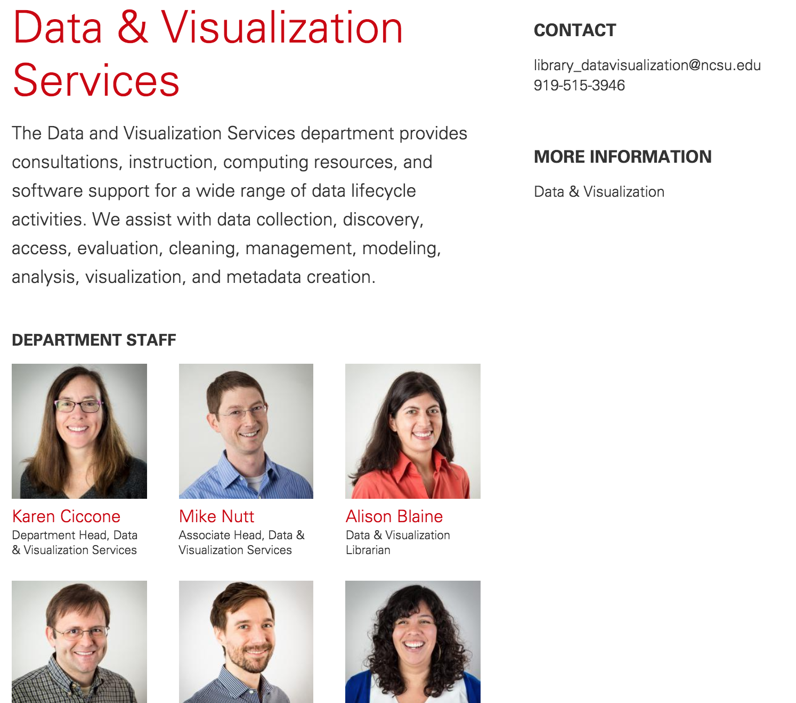

# Data Cleaning and Reconciliation with OpenRefine

---

## Data & Visualization Services

[https://www.lib.ncsu.edu/department/data-visualization-services](https://www.lib.ncsu.edu/department/data-visualization-services)

[https://www.lib.ncsu.edu/services/data-visualization](https://www.lib.ncsu.edu/services/data-visualization)

---

## Data Cleaning

Cleaning data means removing problematic characters, whitespaces, symbols, errors, missing elements and inconsistencies.

Data cleaning tools:

- **OpenRefine**
- Excel
- R, SAS, Python

---

## OpenRefine

- Formerly owned by Google, now maintained by independent developers
- Free, open source tool that makes it easy to clean and transform large data sets
- You can find problems in your data set without knowing about them in advance
- Requires downloading the software in order to use [http://openrefine.org/download.html](http://openrefine.org/download.html)
- GREL documentation: [https://github.com/OpenRefine/OpenRefine/wiki/GREL-Functions](https://github.com/OpenRefine/OpenRefine/wiki/GREL-Functions)

---

## Today's Workshop Materials

[http://go.ncsu.edu/open-refine](http://go.ncsu.edu/open-refine)
